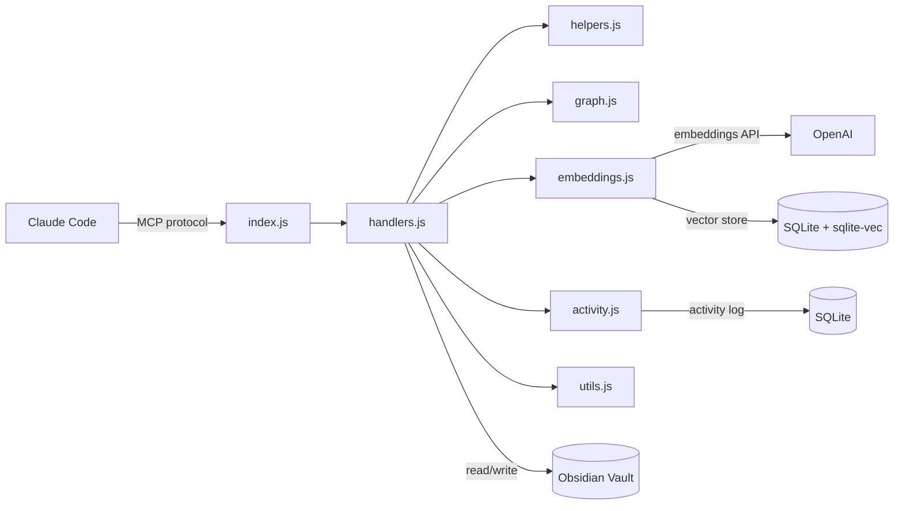

# Obsidian PKM MCP Server

[](https://opensource.org/licenses/MIT)
[](https://nodejs.org/)
[](https://github.com/AdrianV101/Obsidian-MCP/actions/workflows/ci.yml)

An MCP (Model Context Protocol) server that gives Claude Code full read/write access to your Obsidian vault. 18 tools for note CRUD, full-text search, semantic search, graph traversal, metadata queries, and session activity tracking.

## Why

Claude Code is powerful for writing code, but it forgets everything between sessions. This server turns your Obsidian vault into persistent, structured memory that Claude can read and write natively.

- **Session continuity** - Claude logs what it did and can pick up where it left off
- **Structured knowledge** - ADRs, research notes, devlogs created from enforced templates, not freeform text dumps
- **Semantic recall** - "find my notes about caching strategies" works even if you never used the word "caching"
- **Graph context** - Claude can explore related notes by following wikilinks, not just keyword matches

Without this, every Claude Code session starts from scratch. With it, your AI assistant has a working memory that compounds over time.

<https://github.com/AdrianV101/Obsidian-MCP/raw/master/demo.mp4>

## Features

| Tool | Description |
|------|-------------|
| `vault_read` | Read note contents (pagination by heading, tail, chunk, line range; auto-redirects large files to peek data) |
| `vault_peek` | Inspect file metadata and structure without reading full content |
| `vault_write` | Create notes from templates (enforces frontmatter) |
| `vault_append` | Append to notes, with positional insert (after/before heading, end of section) |
| `vault_edit` | Surgical string replacement |
| `vault_search` | Full-text search across markdown files |
| `vault_semantic_search` | Semantic similarity search via OpenAI embeddings |
| `vault_suggest_links` | Suggest relevant notes to link based on content similarity |
| `vault_list` | List files and folders |
| `vault_recent` | Recently modified files |
| `vault_links` | Wikilink analysis (incoming/outgoing) |
| `vault_neighborhood` | Graph exploration via BFS wikilink traversal |
| `vault_query` | Query notes by YAML frontmatter (type, status, tags, dates, custom fields, sorting) |
| `vault_tags` | Discover tags with counts; folder scoping, glob filters, inline tag parsing |
| `vault_activity` | Session activity log for cross-conversation memory |
| `vault_trash` | Soft-delete to `.trash/` (Obsidian convention), warns about broken incoming links |
| `vault_move` | Move/rename files with automatic wikilink updating across vault |
| `vault_update_frontmatter` | Atomic YAML frontmatter updates (set, create, remove fields) |

### Fuzzy Path Resolution

Read-only tools accept short names that resolve to full vault paths:

```javascript
vault_read({ path: "devlog" })
// Resolves to: 01-Projects/Obsidian-MCP/development/devlog.md

vault_read({ path: "devlog.md" })
// Same result — .md extension is optional

vault_links({ path: "alpha" })
// Works on vault_links, vault_neighborhood, vault_suggest_links too
```

Folder-scoped tools accept partial folder names:

```javascript
vault_search({ query: "API design", folder: "Obsidian-MCP" })
// Resolves folder to: 01-Projects/Obsidian-MCP

vault_tags({ folder: "Obsidian-MCP" })
// Works on vault_search, vault_query, vault_tags, vault_recent
```

Ambiguous matches return an error listing candidates. Exact paths always work unchanged.

## Prerequisites

- **Node.js >= 18** (uses native `fetch` and ES modules)
- **C++ build tools** for `better-sqlite3` native addon:
  - **macOS**: `xcode-select --install`
  - **Linux**: `sudo apt install build-essential python3` (Debian/Ubuntu) or equivalent
  - **Windows**: Install [Visual Studio Build Tools](https://visualstudio.microsoft.com/visual-cpp-build-tools/) with the "Desktop development with C++" workload

## Quick Start

### 1. Install

```bash
git clone https://github.com/AdrianV101/Obsidian-MCP.git
cd Obsidian-MCP
npm install
```

### 2. Register with Claude Code

Add to `~/.claude/settings.json`:

```json
{
  "mcpServers": {
    "obsidian-pkm": {
      "command": "node",
      "args": ["/absolute/path/to/index.js"],
      "env": {
        "VAULT_PATH": "/absolute/path/to/your/obsidian/vault"
      }
    }
  }
}
```

Restart Claude Code. The server provides all tools except semantic search out of the box.

### 3. Enable Semantic Search (optional)

Add your OpenAI API key to the env block:

```json
"env": {
  "VAULT_PATH": "/absolute/path/to/your/obsidian/vault",
  "OPENAI_API_KEY": "sk-..."
}
```

This enables `vault_semantic_search` and `vault_suggest_links`. Uses `text-embedding-3-large` with a SQLite + sqlite-vec index stored at `.obsidian/semantic-index.db`. The index rebuilds automatically — delete the DB file to force a full re-embed.

## Vault Structure

The server works with any Obsidian vault. The included templates assume this layout:

```
Vault/
├── 00-Inbox/
├── 01-Projects/
│   └── ProjectName/
│       ├── _index.md
│       ├── planning/
│       ├── research/
│       └── development/decisions/
├── 02-Areas/
├── 03-Resources/
├── 04-Archive/
├── 05-Templates/          # Note templates loaded by vault_write
└── 06-System/
```

### Templates

Copy the files from `templates/` into your vault's `05-Templates/` folder. `vault_write` loads all `.md` files from that directory at startup and enforces frontmatter on every note created.

Included templates: `project-index`, `adr`, `devlog`, `permanent-note`, `research-note`, `troubleshooting-log`, `fleeting-note`, `literature-note`, `meeting-notes`, `moc`, `daily-note`, `task`. Add your own templates to `05-Templates/` and they become available to `vault_write` automatically.

### CLAUDE.md for Your Projects

`sample-project/CLAUDE.md` is a template you can drop into any code repository to wire up Claude Code with your vault. It defines context loading, documentation rules, and ADR/devlog conventions.

## Architecture



```
├── index.js          # MCP server, tool definitions, request routing
├── handlers.js       # Tool handler implementations
├── helpers.js        # Pure functions (path security, filtering, templates)
├── graph.js          # Wikilink resolution and BFS graph traversal
├── embeddings.js     # Semantic index (OpenAI embeddings, SQLite + sqlite-vec)
├── activity.js       # Activity log (session tracking, SQLite)
├── utils.js          # Shared utilities (frontmatter parsing, file listing)
├── templates/        # Obsidian note templates
└── sample-project/   # Sample CLAUDE.md for your repos
```

All paths passed to tools are relative to vault root. The server includes path security to prevent directory traversal.

## How It Works

**Note creation** is template-based. `vault_write` loads templates from `05-Templates/`, substitutes Templater-compatible variables (`<% tp.date.now("YYYY-MM-DD") %>`, `<% tp.file.title %>`), and validates required frontmatter fields (`type`, `created`, `tags`).

**Semantic search** embeds notes on startup and watches for changes via `fs.watch`. Long notes are chunked by `##` headings. The index is a regenerable cache stored in `.obsidian/` so it syncs across machines via Obsidian Sync. The initial sync runs in the background — search is available immediately but may return incomplete results until sync finishes (a progress message is shown).

**Graph exploration** resolves `[[wikilinks]]` to file paths (handling aliases, headings, and ambiguous basenames), then does BFS traversal to return notes grouped by hop distance.

**Activity logging** records every tool call with timestamps and session IDs, enabling Claude to recall what happened in previous conversations.

## Contributing

Contributions are welcome! Please read [CONTRIBUTING.md](CONTRIBUTING.md) for development setup, code style guidelines, and the pull request process before submitting changes.

## License

MIT

